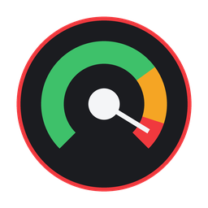
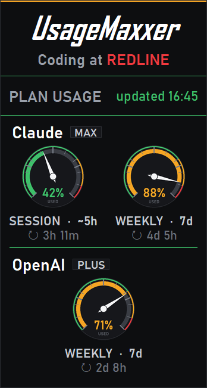

# UsageMaxxer

*Coding at Redline.*

A Windows system-tray widget that shows, at a glance, how close you are to the
usage limits on the AI coding tools you're logged into — **Claude Code** and
**Codex** — as a race-car instrument cluster.

<p align="center"></p>

<p align="center"></p>

- **Session** (~5-hour window, when the provider exposes it) and **Weekly** (7-day window) shown as analog gauges,
  green → amber → red as you approach the limit.
- Reads the login token each CLI **already stores locally** and calls
  that provider's own usage endpoint. All gauges show the percentage **used**.
  Codex's endpoint reports percentage *remaining*, so the widget converts it to
  percentage used — confirmed against the official Codex app. Nothing to configure.
- A tray icon that stays legible on light **and** dark taskbars, colored by your
  worst-case utilization.
- Auto-detects which tools you're logged into and shows only those. Missing or
  logged-out providers degrade gracefully without taking down other providers.

## Install

1. Download **`UsageMaxxer.exe`** and its `.sha256` file from the
   [latest release](../../releases/latest).
2. Verify the checksum, then double-click the executable. It lands in your
   system tray (the `^` overflow area).
3. **SmartScreen note.** The app is open-source but **unsigned**, so Windows
   SmartScreen may show *"Windows protected your PC."* Click **More info →
   Run anyway**. (This is expected for any unsigned indie app; the full source is
    right here in this repo — see the trust story below.)

In PowerShell, verify a downloaded binary with:

```powershell
(Get-FileHash .\UsageMaxxer.exe -Algorithm SHA256).Hash.ToLower()
Get-Content .\UsageMaxxer.exe.sha256
```

The two hashes must match.

Right-click the tray icon → **Settings** to toggle providers or enable
**start on login**. Left-click the icon (or *Show gauges*) to open the panel.

### A note on Claude Code's gauge

Only the terminal `claude` CLI ever rewrites the token file the widget reads
(`~/.claude/.credentials.json`) — the Claude Code **desktop app** signs in
separately and never touches it. So if you work mainly in the desktop app,
that on-disk token would simply expire a few hours after your last terminal
run. The widget handles this itself: when the stored token expires, it uses
the accompanying refresh token to mint a fresh one (the same OAuth refresh the
CLI performs) and writes it back to the same file, so the gauge stays live —
and your next terminal `claude` run benefits from the refreshed login too. If
the refresh cannot be completed (for example, after a real logout), the widget
keeps last-known numbers dimmed and asks you to log in again.

(We tried routing around this with Anthropic's long-lived `claude setup-token`
token, but confirmed live that it doesn't carry the OAuth scope this specific
usage endpoint requires — it 403s every time. So Claude Code's on-disk token
is the only one that works here.)

## Is it safe? (the trust story)

The widget never asks you for a password or token. It reads the credential file
the CLI you already use keeps on your own machine, and makes at most two HTTPS
requests per provider — both to that provider's own API.

- **Claude Code** — reads `~/.claude/.credentials.json`, calls
  `GET https://api.anthropic.com/api/oauth/usage`; if the stored token has
  expired, it first calls `POST https://console.anthropic.com/v1/oauth/token`
  (Anthropic's own OAuth refresh, the same one the CLI performs) and writes
  the refreshed token back to that same file — the only file it ever writes.
- **Codex** — reads `~/.codex/auth.json`, calls
  `GET https://chatgpt.com/backend-api/wham/usage`.

That is the entire network surface. Authenticated requests reject redirects,
response bodies are size-limited, tokens are never logged, and nothing is sent
to any third party. The whole fetch is about 150 lines you can read in
[`usagemaxxer.py`](usagemaxxer.py) (`fetch_claude`,
`_refresh_claude_oauth`, and `fetch_codex`). If a refresh isn't possible
(you truly logged out), the widget just shows the last-known numbers dimmed.

## Run from source

Requires Python 3.10+.

```sh
pip install --require-hashes -r requirements.txt
python usagemaxxer.py --once   # print both usage snapshots as text
pythonw usagemaxxer.py         # run the tray widget (no console window)
```

## Build the .exe

```sh
pip install --require-hashes -r requirements.lock
pyinstaller --noconfirm --onefile --windowed ^
  --name UsageMaxxer --icon assets/app.ico ^
  --version-file version_info.txt ^
  --add-data "assets/app.ico;assets" ^
  --hidden-import pystray._win32 ^
  usagemaxxer.py
```

The standalone `.exe` appears in `dist/`. End users need no Python. CI validates
the release tag against embedded version metadata, publishes a SHA-256 checksum,
and creates a GitHub provenance attestation before preparing a draft release.

## Notes

- **Alerts are passive** in v1: gauges and the tray icon shift color (amber ≥ 70%,
  red ≥ 90%). No toast pop-ups.
- Polls every ~5 minutes, re-reading the credential files each time. Claude's
  token is refreshed in place when it expires; Codex's CLI keeps its own file
  fresh.
- Windows only for now. Claude exposes Session + Weekly; Codex now exposes Weekly
  only (its short window was retired upstream), so its band shows a single Weekly
  gauge. Each provider renders exactly the windows it reports — no empty cells.

## License

[MIT](LICENSE). See [third-party notices](THIRD_PARTY_NOTICES.md). A RigLord project.
